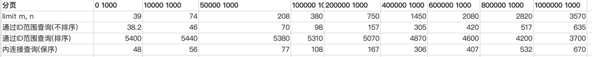

## 分页查询

分页查询是一个很基本的查询需求，主要包括了两个参数：pageIndex, pageSize。其中 pageIndex with pageSize -> offset。通过 offset + pageSize, 可以得到 offset 之后 pageSize 条记录。

### MySQL 实现

常见的实现是 `order by xxx limit os, ps`。

limit 在实际上是**基于排序**实现的，因此需要使用 order by, 当然如果不用 order by 但是 where 能走到索引也可以的。

这样的操作虽然ok，但是会带来两个问题：

1. 翻页时重复/遗漏
2. 性能损耗

#### 避免重复/遗漏

想象一下，你有 5 4 3 2 1 五条记录。第一页你得到了【5，4】，如果你插入了一条数据 6，得到了 6 5 4 3 2 1，此时你再 limit 2, 2 实际上得到的是【4，3】，**重复了**。如果你删除了数据 4，得到5 3 2 1，此时再翻页，得到的是【2，1】，你**遗漏**了一条数据 3。

- 针对重复的问题，可以屏蔽后面插入的数据。具体来说，前端再多传一个 firstQueryTime，然后分页的时候只筛选出 where created_time < firstQueryTime 的数据。**相当于是照了一个快照。**
- 针对遗漏的问题，可以使用逻辑删除不太优雅地实现。也是使用 firstQueryTime，然后分页的时候筛选 where is_deleted = 0 or (is_deleted = 1 and updated_time > firstQueryTime) 的数据。

> 就算没有数据的插入/删除，limit 也可以发生重复/遗漏。
>
> 这是因为我们前面提到，limit 是基于排序的，MySQL内置了多种排序算法，一些情况下如果使用了不稳定的排序算法（如堆排），就会出现排序不稳，limit发生重复/遗漏的情况。
>
> 解决的办法可以用唯一字段，如id，作为第二排序字段，从而保证整个排序字段是唯一的。

#### 性能优化

如果只是翻个前几页，性能是还可以的。但是一旦翻的页数多了，例如 limit 10000, 10，此时就会暴露出严重的性能问题。为什么会这样？

我们看看一条语句：`select * from user where level > 3 order by id limit 10000, 10` (idx_level), 这条语句执行的过程是这样的：

1. 根据 idx_level， 捞出满足条件 level > 3 的所有 id（idx_level 是**非聚簇索引**，只能得到主键 id）
2. 是对于每个 id，都需要回表找到对应的整条记录。
3. limit 10000, 10 意味着至少要回表 10010 次（这个至少取决于有没有索引），然后丢掉前 10000 条记录，选出最后 10 条返回。

可以发现，性能的痛点在于「回表」。我们真正只需要回表 10 次，但是 limit 10000, 10 却做了 10010 次无意义的回表。

回表是面向索引和id的，我们可以从这方面入手，我只取排序字段（此处是id）不回表，拿到 id 后，从 id 往后查 10 个，不就好了吗？也就是写成这样：

`select * from user where id >= (select id from user where level > 3 order by id limit 10000, 1) order by id limit 10`

分析一下，发现内层子查询是不回表的，因为索引当中存了 (level, id), 只在外层回表了10次。相比于原始的方法有大大的提升。

**避免回表的本质是把非聚簇索引转移到聚簇索引（主键id）的索引上。**

基于以上思想，对于 limit M, N 我们可以提出几个改进策略：

1. 内层子查询：在内层嵌一个子查询，查出起始的 order by 字段（id） limit M, 1，然后在外层直接 字段 > 某值 limit N。
> 用 order by age 也是类似的：
>
> `select * from user where age >= (select age from user where level > 3 order by age limit 10000, 1) order by age limit 10`。
>
> 如果有idx_level_age, 内层是不需要回表的。
2. INNER JOIN：先在临时表里面查出 id，再用通过 INNER JOIN 回表。
> 还是上面的例子，可以改造为：
>
> `select * from user t, (select id from user where level > 3 order by age limit 10000, 10) sub_t where t.id = sub_t.id order by age`
>
> 同样的，只要有 idx_level_age, 由于索引覆盖，也是不需要回表的。
3. 从业务层中带入上一页的字段，在本轮当中直接带上 字段 > 值即可。称之为标签记录法。

以上的三种策略中，方法3与业务耦合，不建议采用。

方法1和方法2类似，只要保证内层有索引覆盖不会回表就行。但是！一般建议用方法2，看下面两个语句：

> `select * from user where age >= (select age from user where level > 3 order by age limit 10000, 1) order by age limit 10`
>
> `select * from user t, (select id from user where level > 3 order by age limit 10000, 10) sub_t where t.id = sub_t.id order by age`

如果 user 表中**不存在 age 的索引**，那么最外边的 order by 是要全表扫描的。而区别就在这里：

- 对于方法1，全表扫描的范围是**所有 age > xxx 的数据**，量很大。
- 对于方法2，全表扫描的范围是 **JOIN 后的数据集合**，有多大呢？在这里只有10条。

因此，更建议采用方法2。

另外，如果 order by 字段和 id 是趋势一致的（如自增 id + created_time），那么可以用 id 来 order by。

### DeepPagerInterceptor 实现与使用

基于以上的分析，我选取了侵入小、性能好、易于实现的 JOIN 法来实现深分页优化器。

具体的实现可以查看 DeepPagerInterceptor 当中的代码，总体来说，就是通过 Druid 默认的 Visitor 访问 SQL 语句解析出来的抽象语法树，从而去实现 SQL 语句的改造。

在使用上，DeepPagerInterceptor 通过 comment label 来拦截 SQL 语句，可以分为两步：

1. 引入插件，可以用 mybatis-config 也可以用注解引入
2. 在 mapper.xml 文件当中，增加 comment label `/*deep-pager:single*/, 例如：

> /\*deep-pager:single\*/ select * from tb where age > 18 order by id desc limit 99999, 10;

### 性能测试

#### 测试环境

| 总数据量 | 符合条件的数据量 | 索引                |
|------|----------|-------------------|
 | 500w | 100w     | age, created_time |

#### 测试方案

1. 简单 Limit: `select * from tb where age = 18 order by created_time limit m, n`
2. 子查询（不排序）： `select t.* from tb t where id >= (select id from tb where age = 18 order by created_time limit m, 1) limit n`
3. 子查询（排序）：`select t.* from tb t where id >= (select id from tb where age = 18 order by created_time limit m, 1) order by created_time limit n`
4. JOIN： `select t.* from tb t, (select id from tb where age = 18 order by created_time limit m, n) t2 where t.id = t2.id order by created_time`

#### 测试结果

#### 结果分析

子查询（排序）有严重的性能问题，这点我们已经分析过，外部排序时没有对应的索引，导致全表扫描。而 offset 增大时，需要排序的数量减少，所以性能慢慢变好一些。

简单 limit 的问题就是 offset 越大，性能越差。

子查询（不排序）和 JOIN 的性能相仿，深分布的表现都明显好于简单 limit。

